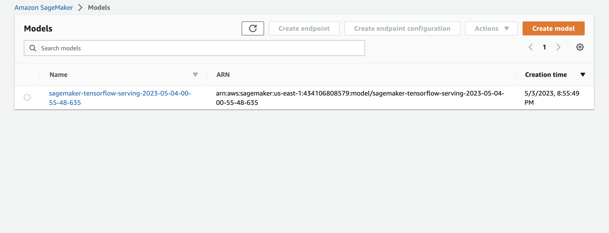
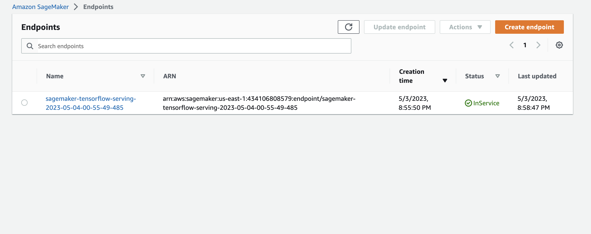

# IDS721FinalProj
This is my redo final project for IDS721
In this project, I have used AWS SageMaker to host pretrained model, deploy and test it.

## Set Up

To rebuild this project, follow these steps:

**Step 1: Create AWS SageMaker Instance**

* Open AWS console and search "AWS SageMaker".
* Click "Studio", and create a domain, choose "Quick setup"
* Enter Domain name, eg: "ids"
* In User profile part, create a new role and then click submit
* Wait AWS SageMaker to be created

**Step 2: Upload Machine Learning Model to SageMaker**

* Choose your own model to upload.
* If you do not have your own model, I provide a pretrained model("model.h5"). 
* You can find your own pre-trained model by visiting these websites
    * [Model Zoo](https://modelzoo.co/)
    * [TensorFlow](https://www.tensorflow.org/resources/models-datasets)
    * [Pytorch Hub](https://pytorch.org/hub/)
* Load your own model

**Step 3: Convert the Keras Model to the format AWS wants**

* Converts to a Protobuff file
* Saves it in a certain aws file structure
* Tarballs this file and zips it

**Step 4: Move the tarball (tar.gz) to S3**

* Upload your model.tar.gz file to your AWS S3 bucket.

**Step 5: Create a SageMaker Model**

* Create an empty train.py file (TensorFlowModel expects this at its 'entry point', but can be empty). 

**Step 6: Host and Deploy**

* Host the SageMaker model and deploy it, this can take ~10 minutes.
* Ignore the message `update_endpoint is a no-op in sagemaker>=2`.
* Create an Endpoint to access the model. 

**Step 7: Test Machine Learning Model**

Now, we want to use our endpoint/model. Create a predictor which uses the endpoint

This step depends on what inputs your model is expecting. I simply used the iris dataset and so can feed it 4 inputs of which it will give me 3 probabilities - 1 for each iris type. 

Before deploying to aws, I got the predictions of my model - __locally__ - so that I could compare the local vs aws results (they should be the same). 

Locally, with the input below we get the following predictions:
expected predictions:

- 0.99930930
- 0.00069067377
- 0.00000000000000015728773

**Step 8: Clean Up**

else you will incur extra charges

https://docs.aws.amazon.com/sagemaker/latest/dg/ex1-cleanup.html

- Stop Notebook
- delete endpoints
- delete models
- delete S3 bucket
- delete cloudwatch groups

## Demo Video

## References
[ref articles](https://aws.amazon.com/blogs/machine-learning/deploy-trained-keras-or-tensorflow-models-using-amazon-sagemaker/)

